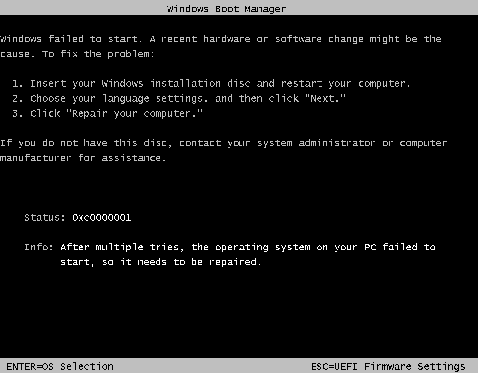

## FAQ

### 0xc0000001 error occurs when booting VHD/VHDX



The cause is unknown.  
Press `Enter` twice to continue booting.  

### Fuzzy screen when booting on GRUB 2

Please set terminal to `console` before loading kernel.  
```
terminal_output console
```

### What file system does NTloader support?

NTloader supports WIM images on NTFS, FAT32 and exFAT file systems,  
and VHD/VHDX images on NTFS and exFAT file systems.
For Windows 10 v1803 and previous versions, only NTFS is supported.  

<div style="page-break-after: always;"></div>

